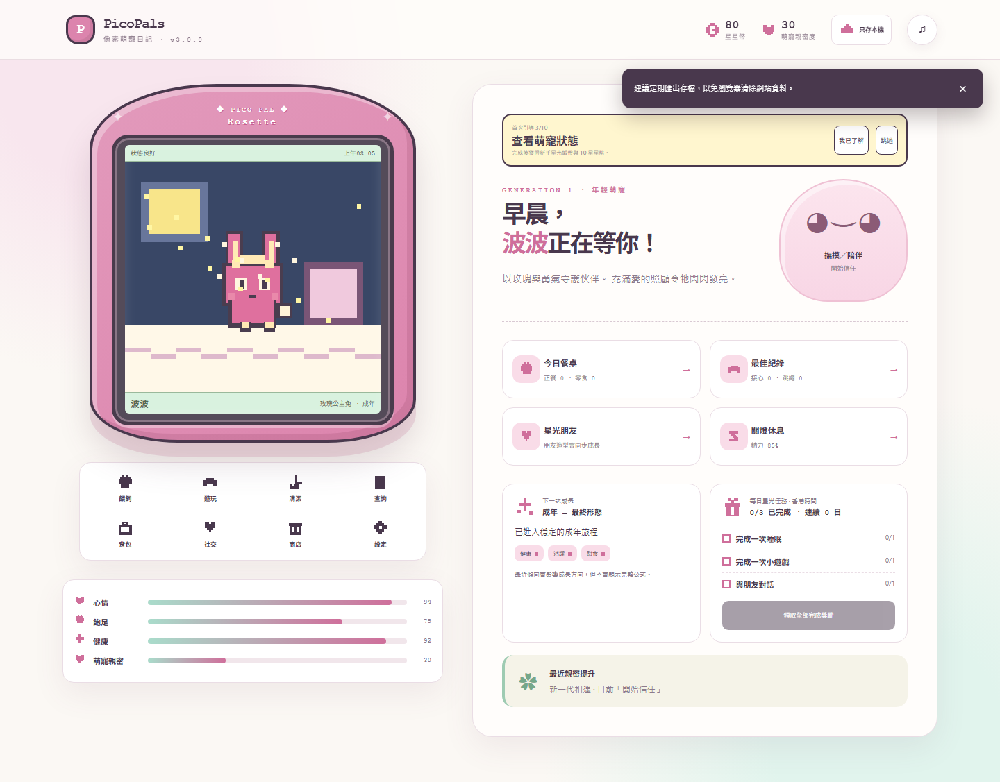

# PicoPals 8-Bit v3

原創、離線優先、支援手機與電腦的 8-bit 電子寵物 PWA。

## 立即遊玩

[開啟 PicoPals 8-Bit](https://sion-rgb.github.io/picopals-8bit/)



## v3 重點

- IndexedDB 仍是主要資料來源；所有照顧操作先在本機完成，不等待雲端。
- Schema v1/v2 無損升級至 v3，升級前自動建立快照；JSON 備份不包含 UID、Token 或 Firebase 設定。
- 自選 Firebase Authentication + Cloud Firestore 同步；未設定、未登入、斷線或額度錯誤時仍可完整遊玩。
- Revision、SHA-256 checksum、compare-and-set、最近 10 個快照、最近 50 項紀錄及雙版本衝突處理。
- BroadcastChannel 與 30 秒 IndexedDB 鎖，避免同一裝置多分頁重複上傳。
- 設定頁可檢查網絡、Service Worker、App Shell Cache、IndexedDB 與 Persistent Storage；清除程式快取不會刪除存檔。
- 20 種原創主寵輪廓、六位朋友各四階段造型、共用 Canvas 繪圖資料及原創 SVG 像素圖示表。
- 每日三項香港時間任務、連續完成獎勵、可跳過／重看的十步新手引導、每日本機生成朋友圈。
- 固定 4×2 操作矩陣，支援方向鍵、Enter、Escape、觸控及高對比模式。
- 無廣告、無課金、無抽卡、無 AI API、無第三方角色素材。

## 本機開發

需要 Node.js 22 或更新版本。

```bash
npm install
npm run dev
```

驗證指令：

```bash
npm test
npm run test:rules
npm run test:e2e
npm run build
```

`npm run test:rules` 會啟動本機 Firestore Emulator；需要 Java。Playwright 首次執行前請使用 `npx playwright install chromium`。

## Firebase（可選）

遊戲預設只儲存在目前裝置。要啟用正式跨裝置同步：

1. 登入 Firebase CLI 並建立或選擇專案。
2. 啟用 Cloud Firestore、Google Authentication，以及需要時的 Email/Password Authentication。
3. 將 `sion-rgb.github.io`、`localhost`、`127.0.0.1` 加到 Authentication 授權網域。
4. 以 `.env.example` 的六個名稱建立本機 `.env`，並在 GitHub Repository Variables 建立同名變數。
5. 執行 `firebase deploy --only firestore:rules,firestore:indexes`。

未提供上述變數時，Production Build 仍會成功，設定頁會明確顯示「雲端服務尚未設定」。Service Account、Admin SDK 金鑰、Firebase CLI Token 與 GitHub Token 不應加入此 Repository。

## 部署與測試

推送 `main` 後，GitHub Actions 會執行 51 項單元測試、8 項 Firestore Rules Emulator 測試及 Production Build，再部署 `dist/` 至既有 GitHub Pages 網址。Playwright 提供 18 條流程，並在 desktop/mobile 兩個專案執行。

## 隱私

- 不登入時，遊戲資料只存在瀏覽器 IndexedDB。
- 玩家必須主動登入、開啟同步並確認首次上傳，現有存檔才會離開裝置。
- 雲端只保存遊戲存檔、revision、快照、裝置短識別與同步紀錄；不收集 IP、精確位置或完整 User Agent。
- 登出、關閉同步或刪除雲端副本都不會刪除本機存檔。

## 授權

程式以 [MIT License](LICENSE) 發佈。第三方套件說明見 [THIRD_PARTY_NOTICES.md](THIRD_PARTY_NOTICES.md)，版本紀錄見 [CHANGELOG.md](CHANGELOG.md)。
